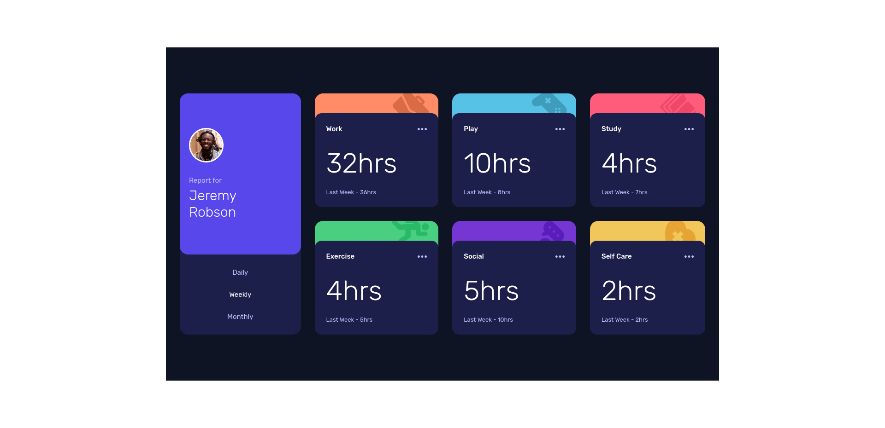

# Frontend Mentor - Time tracking dashboard solution

This is a solution to the [Time tracking dashboard challenge on Frontend Mentor](https://www.frontendmentor.io/challenges/time-tracking-dashboard-UIQ7167Jw). Frontend Mentor challenges help you improve your coding skills by building realistic projects. 

## Table of contents

- [Overview](#overview)
  - [The challenge](#the-challenge)
  - [Screenshot](#screenshot)
  - [Links](#links)
- [My process](#my-process)
  - [Built with](#built-with)
  - [What I learned](#what-i-learned)
  - [Continued development](#continued-development)
  - [Useful resources](#useful-resources)
- [Author](#author)

## Overview

### The challenge

Users should be able to:

- View the optimal layout for the site depending on their device's screen size
- See hover states for all interactive elements on the page
- Switch between viewing Daily, Weekly, and Monthly stats

### Screenshot

### Links

- Solution URL: (https://github.com/francobwogo/time-tracking.git)
- Live Site URL: (https://francobwogo.github.io/time-tracking/)

## My process

### Built with

- Semantic HTML5 markup
- CSS custom properties
- Flexbox
- CSS Grid
- Mobile-first workflow

### What I learned

CSS, HTML and JavaScript

### Continued development

- JavaScript

### Useful resources

- The Odin Project (https://www.theodinproject.com/)
- MDN - (https://developer.mozilla.org/en-US/)
- W3Schools - (https://www.w3schools.com/)

## Author

- Frontend Mentor - [@francobwogo](https://www.frontendmentor.io/profile/francobwogo)
